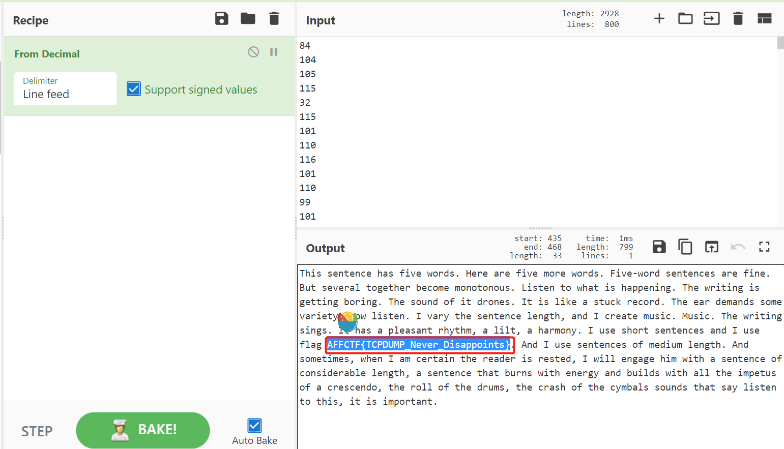

流量包中的TCP包的长度都是小于255的，所以可能是ASCII数据。

使用`tshark -r SharkHasALongTail.pcap -T fields -e tcp.len > tcplength.txt` 提取流量包中的tcp包的长度，然后复制到CyberChef网站去解码即可：

链接：[CyberChef](https://gchq.github.io/CyberChef/#recipe=From_Decimal('Line%20feed',false))

