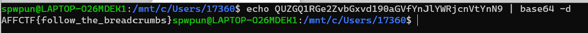

给出了一个恶意样本的hash值，去VirusTotal上搜索，在community下发现pastebin的一个链接，点进去看是一串base64字符串，解码后为flag。

pastebin是一种可以发布代码或文本数据并与他人共享的服务。这道题的出题想法应该来自于这儿：https://paper.seebug.org/1354/

发现Linux Shell的一个快捷之处，之前在线搜索或者用python真的太傻了：

AFFCTF{follow_the_breadcrumbs}